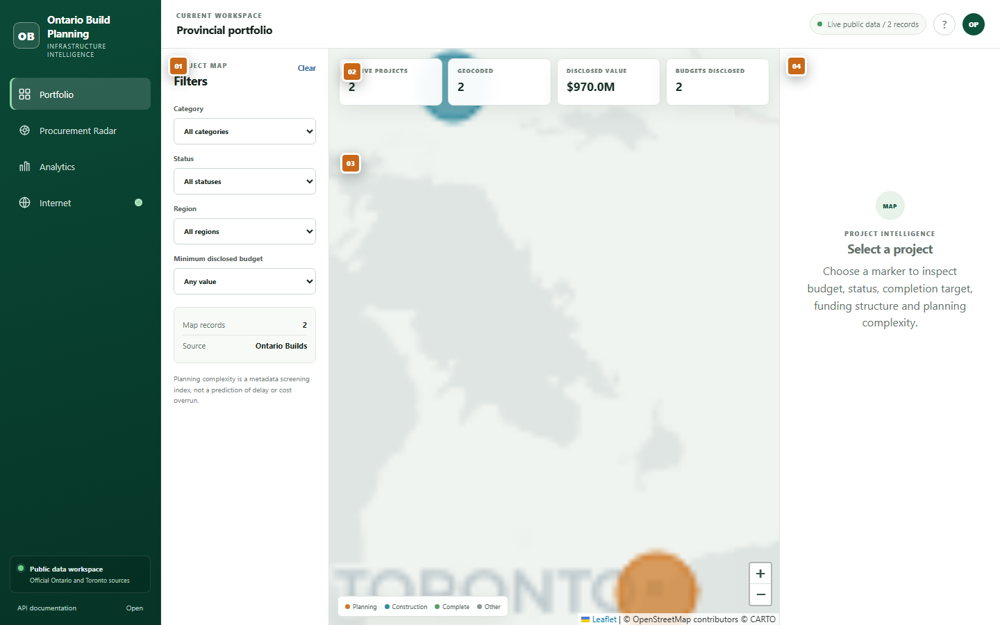
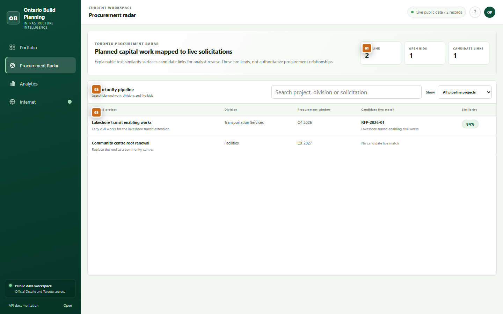
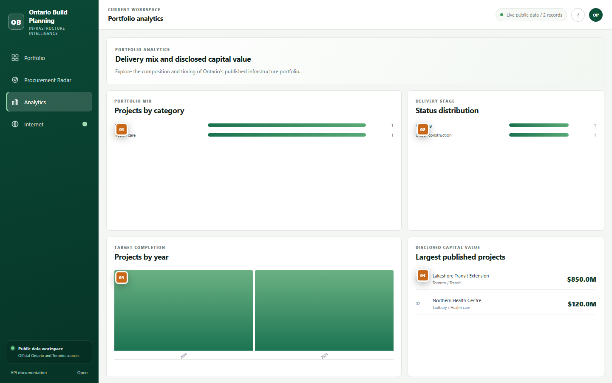
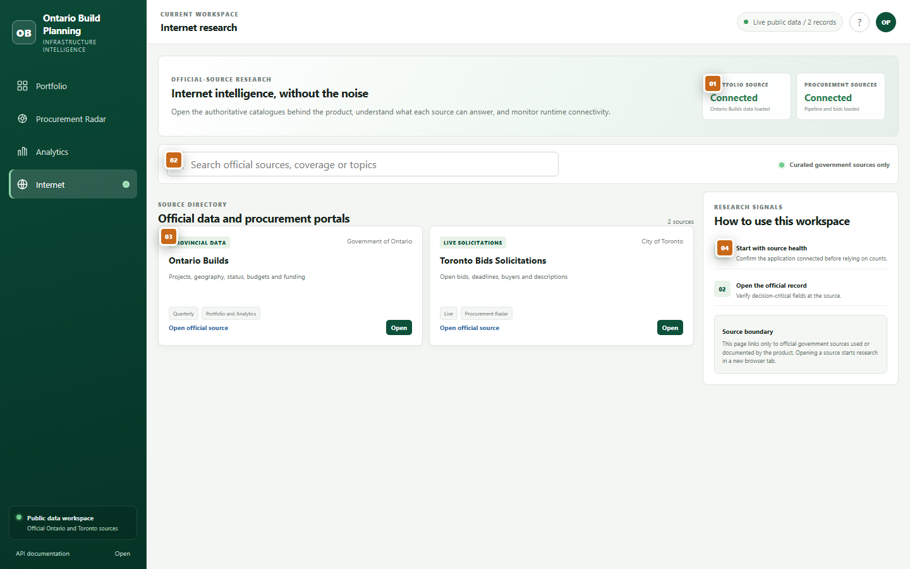

# Numbered product tour

The orange square signals in the README screenshots correspond to the numbered controls below. Screenshots use deterministic illustrative records so the documentation remains stable as public datasets change.

## Portfolio

1. **Filters** narrow the project map by category, delivery status, region and minimum disclosed budget. The record count updates immediately.
2. **Portfolio KPIs** summarize published projects, geocoded records, total disclosed value and the number of disclosed budgets.
3. **Project map** plots geocoded infrastructure records. Marker colour communicates delivery status and marker size reflects disclosed budget bands.
4. **Project intelligence** opens when a marker is selected. It explains published project details and the metadata-based complexity screening score.

## Procurement Radar

1. **Radar KPIs** show planned pipeline projects, currently open bids and projects with at least one candidate link.
2. **Search and match controls** search project, division and solicitation text or limit the table to candidate matches.
3. **Opportunity table** presents the planned record beside its highest-scoring live solicitation candidate and similarity score.

## Analytics

1. **Category mix** compares the number of published projects across infrastructure sectors.
2. **Delivery stage** shows the status distribution reported by the source dataset.
3. **Completion timeline** groups projects by published target-completion year.
4. **Largest disclosed projects** ranks only records with a publicly disclosed budget.

## Internet

1. **Runtime source health** shows whether the Portfolio and Procurement Radar connected to their respective sources during this session.
2. **Official-source search** filters by source name, organization, coverage and research topic. The trust signal indicates that the directory is curated rather than a general web search.
3. **Source directory** explains what each authoritative portal can answer, its update cadence and the workspace that uses it. Each card opens the official site in a new tab.
4. **Research signals** define a verification workflow: check connectivity, open the official record, account for update cadence and respect the product's model boundaries.
